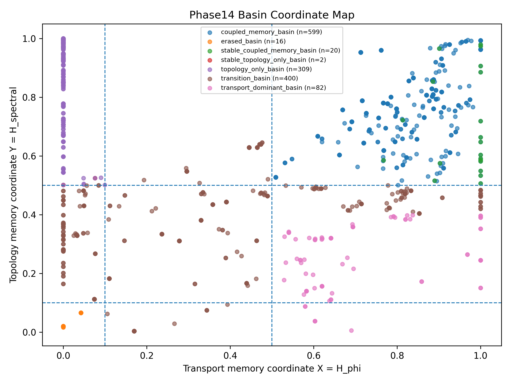
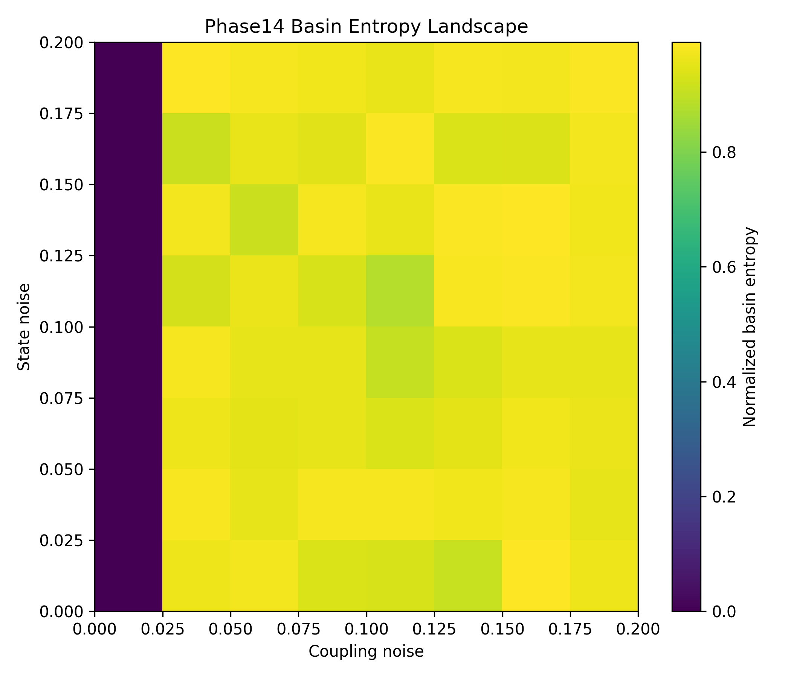
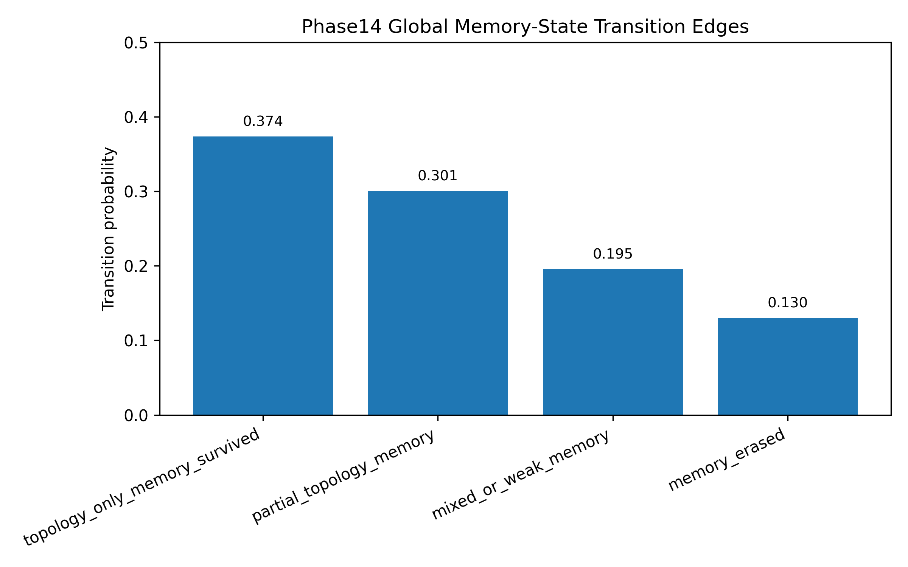
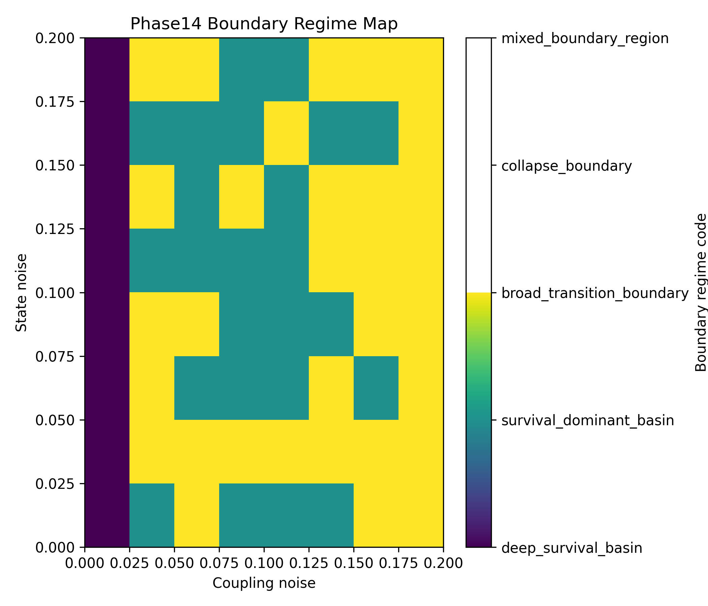
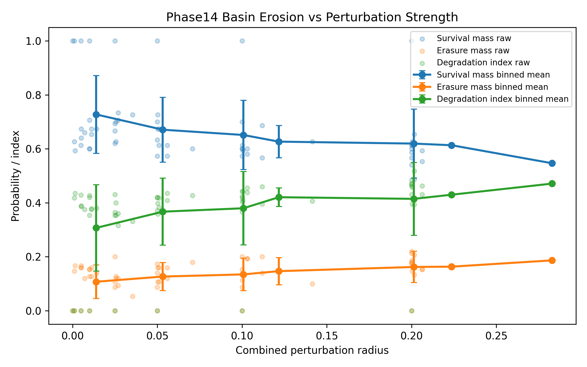
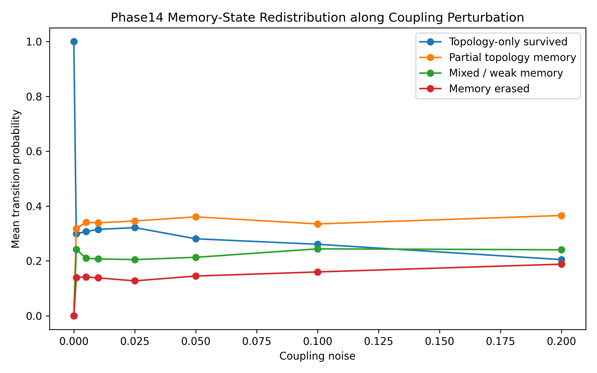
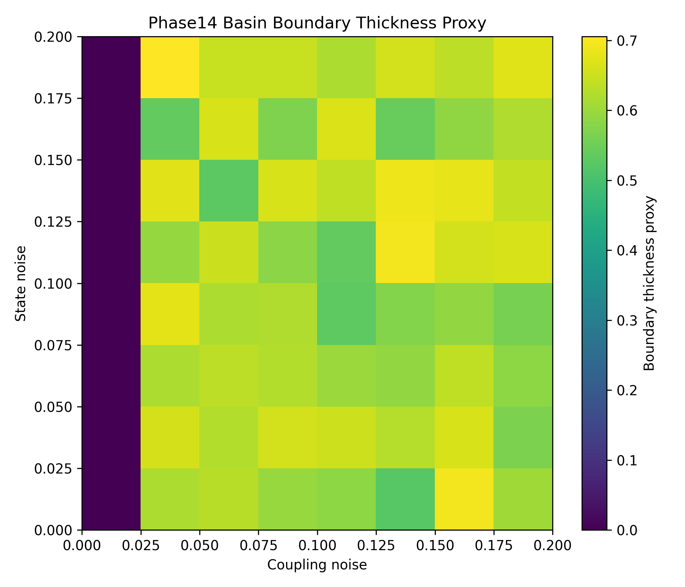

# Abstract

This Phase14 report extends the Phase13 discovery of persistent topology-only structural memory by projecting adaptive memory outcomes into a basin-coordinate representation. The analysis shows that persistent topology memory is not best interpreted as a sharply protected state. Instead, it appears as a broad metastable basin geometry with high basin entropy, probabilistic memory-state redistribution, and gradual perturbation-driven erosion.

The central result is that topology memory frequently survives as either full topology-only memory or partial topology memory, while direct erasure remains a minority outcome. Across the tested perturbation grid, no collapse-boundary regime was detected. This supports the interpretation that SRFM Quantum structural memory is basin-supported, perturbation-degradable, and geometrically organized.

# 1. Introduction

Phase13 established that adaptive transport systems can erase observable transport differences while preserving persistent structural memory in coupling topology. In particular, topology-only memory was observed when transport memory was nearly zero while spectral topology memory remained high.

Phase14 asks a different question:

**Where does topology-only memory live in basin space, and how does perturbation move trajectories between memory basins?**

The working hypothesis is that persistent adaptive structural memory survives because coupling-topology trajectories become trapped in metastable basin regions after observable transport variables relax.

# 2. Basin Coordinate Construction

Phase14 uses a three-layer state decomposition.

- Transport state: observable transport memory.
- Topology state: hidden structural memory in coupling topology.
- Basin state: perturbation-conditioned memory survival, partial retention, weakening, or erasure.

The minimal basin coordinates are:

- X = H_phi
- Y = H_spectral
- Z = basin survival probability

The primary basin classes are:

- topology-only basin
- coupled memory basin
- transport-dominant basin
- erased basin
- transition basin

The imported Phase14 coordinate landscape contains 1428 memory points.

{width=95%}

# 3. Basin Class Structure

The coordinate projection separates memory states into distinct regions.

Key basin counts:

| Basin class | Count | Ratio |
|---|---:|---:|
| topology-only basin total | 311 | 0.217787 |
| coupled memory basin total | 619 | 0.433473 |
| transition basin | 400 | 0.280112 |
| transport-dominant basin | 82 | 0.057423 |
| erased basin | 16 | 0.011204 |

This confirms that topology-only memory remains a distinct basin-coordinate region rather than a residual artifact of transport memory.

# 4. Basin Entropy

Basin entropy was computed over perturbation-conditioned memory-state distributions:

$$
S_{basin} = - \sum_i p_i \log(p_i)
$$

where p_i is the occupancy probability of memory state i.

The observed mean basin entropy was 1.162636, and the maximum basin entropy was 1.374046. With four memory states, the theoretical maximum is log(4), approximately 1.386. The observed maximum is therefore close to maximal state competition.

{width=90%}

The high entropy regions indicate that memory does not collapse deterministically into a single outcome. Instead, survival, partial retention, weakening, and erasure compete across broad perturbation regions.

# 5. Basin Transition Matrix

The perturbation outcomes were summarized as transition probabilities from initial topology memory into four memory states.

{width=85%}

The global transition probabilities were:

| Outcome | Probability |
|---|---:|
| topology-only memory survived | 0.373750 |
| partial topology memory | 0.300729 |
| mixed or weak memory | 0.195417 |
| memory erased | 0.130104 |

The survival mass was 0.674479, while the erasure mass was 0.130104. This shows that perturbation usually redistributes structural memory into partial or weakened states rather than directly erasing it.

# 6. Basin Boundary Regimes

Boundary regimes were classified from survival mass, erasure mass, transition entropy, and degradation index.

{width=90%}

The boundary regime counts were:

| Boundary regime | Count |
|---|---:|
| deep survival basin | 8 |
| survival-dominant basin | 24 |
| broad transition boundary | 32 |
| collapse boundary | 0 |

The absence of detected collapse-boundary regimes is important. It supports the interpretation that memory loss behaves as basin erosion rather than abrupt collapse.

# 7. Erosion Dynamics

To test whether memory degradation is abrupt or gradual, survival mass, erasure mass, and degradation index were plotted against combined perturbation radius.

{width=90%}

Survival mass decreases gradually, while erasure mass increases only weakly. The maximum erasure mass was 0.220000, and the minimum survival mass was 0.486667. Thus, even under strong perturbation, direct erasure does not become the dominant outcome.

# 8. Memory-State Redistribution

The redistribution of memory states along coupling perturbation shows that memory loss proceeds primarily through partial degradation.

{width=90%}

This supports a graded memory-loss pathway:

topology-only survival -> partial topology memory -> mixed or weak memory -> erasure

The key point is that perturbation does not simply destroy memory. It redistributes memory probability across several metastable outcomes.

# 9. Boundary Thickness

A boundary thickness proxy was computed from transition entropy and dominant-state probability. High values indicate distributed basin competition rather than a sharp transition line.

{width=90%}

The mean boundary thickness proxy was 0.544111, and the maximum was 0.705517. The broad high-thickness regions support the interpretation of thick metastable basin boundaries.

# 10. Core Findings

| ID | Finding | Metric | Value |
|---|---|---|---:|
| F1 | Phase13 memory classes project into a structured Phase14 basin-coordinate landscape. | topology_only_basin + stable_topology_only_basin | 311.000000 |
| F2 | Coupled transport-topology memory remains the dominant basin class. | coupled_memory_basin + stable_coupled_memory_basin | 619.000000 |
| F3 | Basin entropy is high across perturbation space. | mean_basin_entropy | 1.162636 |
| F4 | Maximum basin entropy approaches the four-state entropy limit. | max_basin_entropy | 1.374046 |
| F5 | Topology memory mostly survives as full or partial retention. | global_survival_mass | 0.674479 |
| F6 | Direct memory erasure remains a minority outcome. | global_erasure_mass | 0.130104 |
| F7 | Transition entropy remains high in the global transition matrix. | global_transition_entropy_norm | 0.947527 |
| F8 | No collapse-boundary regime was detected in the perturbation grid. | collapse_boundary_count | 0.000000 |
| F9 | Broad transition boundaries occupy a large fraction of perturbation space. | broad_transition_boundary_count | 32.000000 |
| F10 | Erasure remains bounded even at the strongest tested perturbation conditions. | max_erasure_mass | 0.220000 |

# 11. Scientific Interpretation

Phase14 suggests that persistent topology-only memory is a basin-geometric phenomenon. The memory is not simply a high transport state, nor a permanently protected topological state. Instead, it appears as a metastable region of coupling-topology space where transport variables can relax while structural topology differences persist.

The most important conceptual transition is:

Phase13: topology remembers transport history.

Phase14: topology memory lives in broad metastable basin geometries.

The results also suggest a relaxation hierarchy:

$$
\tau_{transport} \ll \tau_{topology}
$$

This does not yet prove a rigorous attractor theorem. However, it gives a reproducible phenomenological basis for describing adaptive structural memory as a basin-supported and perturbation-erodible state.

# 12. Limitations

This Phase14 report is numerical and phenomenological.

It does not claim:

- true topological protection
- universal attractor theorem
- physical quantum memory
- quantum error correction
- quantum hardware validation
- thermodynamic proof
- many-body derivation

The basin classes are threshold-based and should be refined in future phases. The current analysis uses Phase13 perturbation outputs rather than new microscopic simulations.

# 13. Conclusion

Phase14 shows that persistent topology-only memory in SRFM Quantum systems is organized as a broad adaptive basin geometry. Memory degradation is not dominated by abrupt collapse. Instead, perturbation produces gradual erosion and probabilistic redistribution among survival, partial retention, weakening, and erasure states.

One-sentence summary:

**Persistent topology-only memory in SRFM Quantum systems is supported by broad metastable basin geometry with gradual erosion and probabilistic redistribution, rather than by sharp protected thresholds.**
